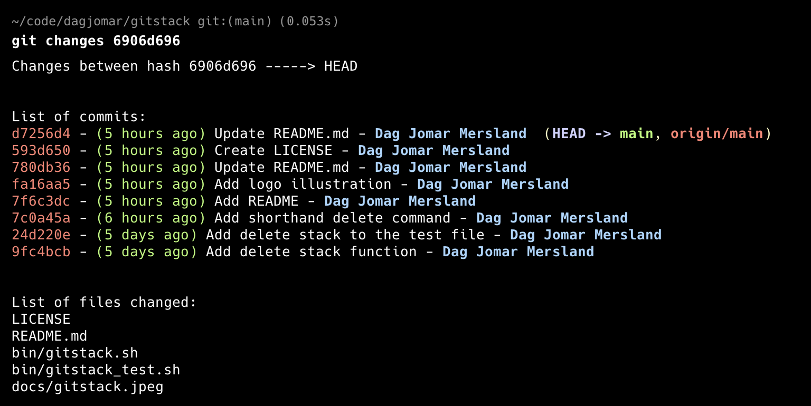

# Git Changes

## An intuitive way to explore changes between Git commits



<br />

## Overview

Git Changes is a powerful yet simple command-line utility that helps developers understand what changed between Git commits. Whether you're preparing for a deployment, reviewing code changes, or debugging production issues, Git Changes provides a clear, formatted overview of commits and file changes with an intuitive interface.

## Why?

As developers, we frequently need to understand what changed between different points in our Git history. Common scenarios include:

- Preparing release notes for a deployment
- Investigating when and why a change was introduced
- Reviewing changes in specific parts of the codebase
- Understanding what will be deployed to production

While Git provides powerful tools like `git diff` and `git log`, they often require:

- Remembering complex command arguments
- Manual combination of multiple commands
- Mental mapping between commit hashes and dates
- Extra effort to filter and format output

Git Changes solves these problems by providing:

- Simple, memorable commands
- Clear, formatted output
- Interactive commit selection
- Smart date-based filtering
- Directory-specific views

## Features

- **Interactive Commit Picker:** Select commits visually with fuzzy search and preview
- **Smart Date References:** View changes from the last N days with simple commands
- **Directory Filtering:** Focus on changes in specific parts of your codebase
- **Commit History Overview:** See all commits with author and timestamp
- **Changed Files List:** Quickly identify which files were modified
- **Flexible References:** Use commit hashes, branch names, or relative references

## Installation

1. **Clone the Repository:**

```bash
git clone https://github.com/yourusername/git-changes.git
cd git-changes
```

2. **Run the Installation Script:**
   The simplest way to install is to run the provided installation script:

```bash
./bin/install_alias.sh
```

This will set up a Git alias to run the script with command alias `git changes`.

Alternatively, you can set up the alias manually:

```bash
git config --global alias.changes '!bash /path/to/git-changes/bin/git-changes.sh'
```

## Usage

After setting up the alias, you can use the following formats:

- **Compare Using Commit Range:**

```bash
git changes abc123 def456
```

- **Interactive Commit Selection:**

```bash
git changes pick                 # Select from all commits
git changes pick frontend       # Select from commits touching frontend
```

- **Time-Based Selection:**

```bash
git changes 5d                  # Show changes in last 5 days
git changes 2days              # Show changes in last 2 days
```

- **Directory Filtering:**

```bash
git changes abc123 def456 ./src  # Show changes only in src directory
```

## Example Output

```bash
Changes between hash abc123 -----> def456


List of commits:
abc123 - (2 days ago) Add user authentication - Jane Doe
bcd234 - (2 days ago) Fix login validation - John Smith
cde345 - (3 days ago) Update dependencies - Jane Doe


List of files changed:
src/auth/login.js
src/components/LoginForm.jsx
package.json
```

## Contributing

Contributions are welcome! Feel free to submit issues or pull requests to enhance Git Changes.

## License

This project is licensed under custom terms - see the [LICENSE](LICENSE) file for details.
